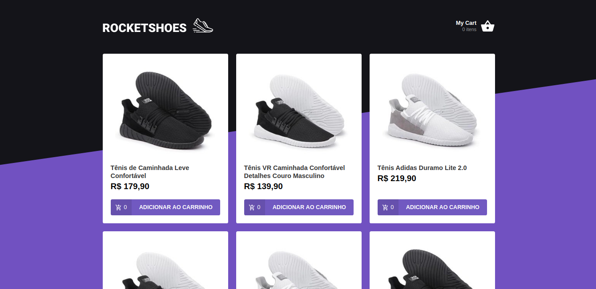

# RocketShoes :rocket:
ReactJS e-commerce project developed on [RocketSeat GoStack Bootcamp](https://rocketseat.com.br/bootcamp). Check the [Mobile Version](https://github.com/rafacdomin/rocketshoes-mobile) made with React Native for Android.



## About
This project is a simple e-commerce where you can choose products and add they to the cart, changing the amount and seeing the subtotal and total price of the actual order.

### Technologies
This project was developed with the following technologies: 

-  [ReactJS](https://reactjs.org/)
-  [Redux](https://redux.js.org/)
-  [Redux-Saga](https://redux-saga.js.org/)
-  [React Router v4](https://github.com/ReactTraining/react-router)
-  [Axios](https://github.com/axios/axios)
-  [Immer](https://github.com/immerjs/immer)
-  [Polished](https://polished.js.org/)
-  [React-Toastify](https://fkhadra.github.io/react-toastify/)
-  [styled-components](https://www.styled-components.com/)
-  [React-Icons](https://react-icons.netlify.com/)
-  [json-server](https://github.com/typicode/json-server)
-  [Reactotron](https://infinite.red/reactotron)


## How To Use
To clone and run this application, you'll need [Git](https://git-scm.com), [Node.js v10.16][nodejs] or higher + [Yarn v1.13][yarn] or higher installed on your computer. From your command line:

```bash
# Clone this repository
$ git clone https://github.com/rafacdomin/RocketShoes

# Go into the repository
$ cd RocketShoes

# Install dependencies
$ yarn install

# Run the server
$ yarn server

# Run the app
$ yarn start
```


Made by Rafael Domingues :wave: [Get in touch!](https://www.linkedin.com/in/rafaelcodomingues/)

[nodejs]: https://nodejs.org/
[yarn]: https://yarnpkg.com/
